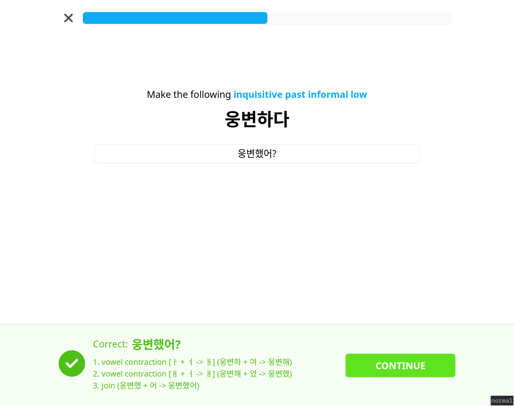

<div align="center">
    
    <h1>말동무 - Your companion for Korean verbs</h1>
</div>



A simple [website](https://korean-conjugation-drill.vercel.app/) designed to 
help you practice your Korean verb conjugations. Practice different formality 
levels, tenses, and grammar forms. Understand how each conjugation is formed 
from the dictionary form of a word.

- [Installation](#installation)
- [Integrations](#integrations)
- [Custom datasets](#custom-datasets)
- [Contributing](#contributing)

## Installation
1. Clone the repository.
    ```bash
    git clone https://github.com/BrookJeynes/maldongmu.git
    ```
2. Navigate into the project directory using your terminal.
    ```bash
    cd korean_conjugation_drill
    ```
3. Install the required packages.
    ```bash
    bun install
    ```
4. Run the web app.
    ```
    bun dev
    ```

## Integrations
- Use your own words exported from [Kimchi Reader](https://kimchi-reader.app/).

## Custom datasets
Custom datasets can be imported. To do so, create a CSV file with the following
format.

```
verb,0
verb,0
...
```

_Note: The imported CSV file should not contain any headers._

## Contribution
Contributions, issues, and feature requests are always welcome!
